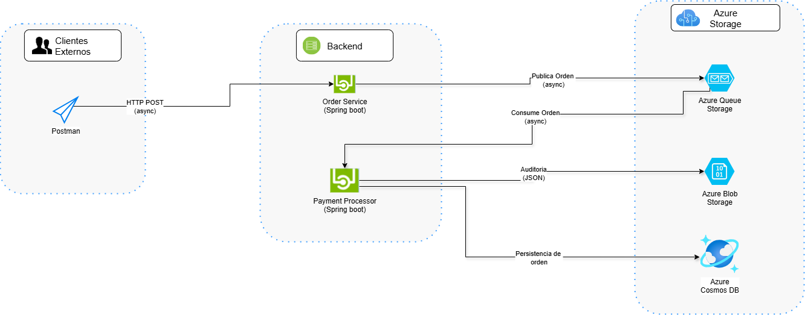

# 📦 Order Service

Microservicio encargado de recibir órdenes a través de una API REST y colocarlas en una Azure Queue Storage para su posterior procesamiento.

---

## 📐 Arquitectura

Este microservicio forma parte de una arquitectura de microservicios basada en:
- Arquitectura Hexagonal (puertos y adaptadores)
- Domain-Driven Design (DDD)

---

## 🚀 Funcionalidad principal

- Expone un endpoint REST (`/v1/order`)
- Envía la orden recibida como mensaje a una **Azure Queue Storage**
- Valida estructura básica de la orden

---

## 🧱 Tecnologías utilizadas

- Java 17
- Spring Boot
- Maven
- Azure Storage Queue SDK
- Lombok
- Arquitectura Hexagonal + DDD

---

## 🛠️ Diagrama de Arquitectura



--


## ▶️ Ejecución

Desde el directorio raíz del proyecto:

```bash
cd order-service
mvn spring-boot:run
